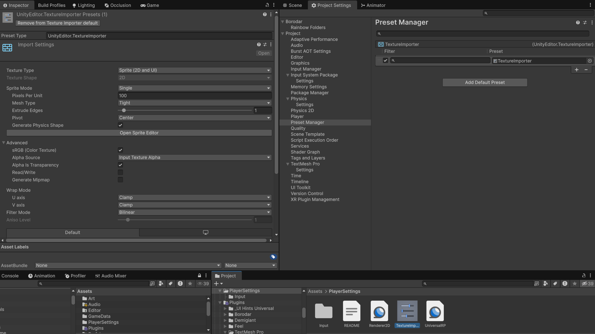

# Adapting the UI

## Адаптация UX/UI

Обратите внимание, что пропорции экранов могут отличаться в зависимости от режима работы устройства. **Nintendo Switch** использует разрешение 1280×720 в Handheld Mode и 1920×1080 в TV Mode. **Проверяйте отображение интерфейса при разных разрешениях** и включайте параметр `Preserve Aspect` у компонентов `Image` с типом `Sprite (2D and UI)`.

Также, можно настроить [пресет](https://docs.unity3d.com/Manual/class-PresetManager.html) чтобы любые загружаемые изображения автоматически становились `Sprite (2D and UI)` с параметром `Single`.

???+ example "Пример настроенного пресета"

    

!!! note

    При экспорте изображений из **Figma** применяйте масштабирование **4x** либо **512w** если нужен конкретный размер (например, для трофеев PlayStation).

!!! tip

    Для добавления UI-подсказок для кнопок рекоммендуется использовать ассет [UI Hints Universal v3.0](https://trello.com/c/kbFEZagK/52-ui-hints-universal-auto-hints).

## Быстрая замена файлов

Для быстрой замены изображения, аудио или 3D-модели **замените файл в папке проекта** новым файлом с теми же **названием, типом и структурой** (например, иерархией FBX).

!!! note

    Такой подход экономит время, снижает вероятность ошибок и упрощает отслеживание изменений в Git по сравнению с изменениями сцен.