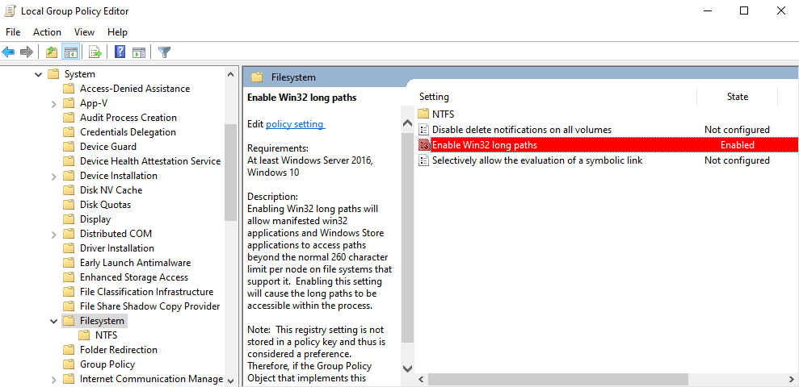
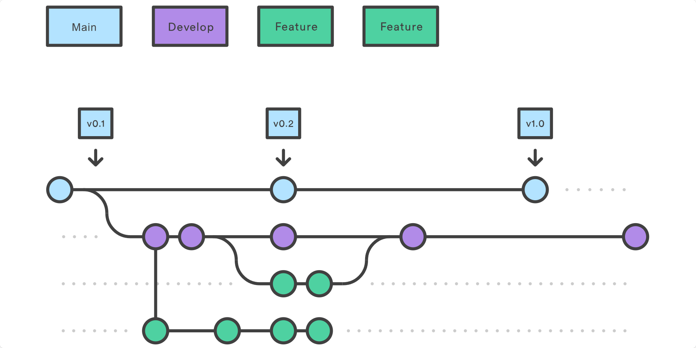

# Git Versioning

## Отсутствие файлов после клонирования

Если **сразу после клонирования** нового проекта с репозитория в приложении **GitHub Desktop** отображаются удаленные файлы с иконкой **(-)** - проверьте длину полного пути к отсутствующим файлам в проводнике.

Рекомендуется клонировать проекты в короткие пути по типу `C:\Work`.

Иногда достаточно **включить поддержку длинных путей** в настройках **Git** и **Windows**:

- **ПКМ** на название **Current repository** в приложении **GitHub Desktop** > **Show in Explorer**
- Нажмите **ЛКМ** в область пути в проводнике > введите `CMD` > ++enter++
- Запустите команду `git config --global core.longpaths true`
- Далее нажмите ++win+r++ и введите > `gpedit.msc` > ++enter++
- Найдите параметр `Enable Win32 long paths` следуя **Computer Configuration** > **Administrative Templates** > **System** > **Filesystem**
-  **ПКМ** на название > **Edit** > **Enabled** > **Apply** > **OK**
- **Перезагрузите ПК** и проверьте GitHub Desktop

???+ example "Пример примененной настройки"

    

## Разделение по контексту

Постарайтесь вести чистую и понятную историю разработки. Рекомендуется придерживаться [Gitflow] в качестве системы ведения веток и [Conventional Commits] как пример оформления коммитов.

Как правило, разработчики создают ветку для каждой платформы, и отдельные - для параллельной работы с 3-D дизайнерами. Окружение при этом можно менять как `Prefab`, чтобы не было конфликтов связанных с изменениями сцен.

[Gitflow]: https://www.atlassian.com/git/tutorials/comparing-workflows/gitflow-workflow
[Conventional Commits]: https://www.conventionalcommits.org/ru/v1.0.0/

???+ example "Пример применения Gitflow"

    

## Хранение больших файлов

Если в вашем проекте есть файлы размером свыше **100** МБ - установите и настройте расширение [Git Large File Storage] (**LFS**). Добавьте эти ассеты в файл `.gitattributes`.

[Git Large File Storage]: https://git-lfs.com/

## Полезные функции Git

Система контроля версий **Git** предоставляет [множество функций][Git Book], например:

- Временно "отложить" локальные изменения (`git stash` или `Stash all changes`)
- Сбросить локальные изменения (`git restore :/` > `git clean -df` или `Discard all...`)
- Добавить файлы к последнему коммиту (`git commit --amend`)
- Скопировать коммиты с одной ветки на другую (`git cherry-pick <commit>`)
- Скопировать часть коммита из другой ветки (удобно в [JetBrains Rider])
- Перенести коммиты с одной ветки на другую ([`git merge` или `git rebase`][Combine Branches])
- Отменить изменения в коммите, создав новый с обратным эффектом (`git revert`)
- Удалить часть коммитов из истории (`git reset`)

[Git Book]: https://git-scm.com/book/ru/v2
[JetBrains Rider]: https://www.jetbrains.com/help/idea/apply-changes-from-one-branch-to-another.html#apply-separate-changes
[Combine Branches]: https://git-scm.com/cheat-sheet

``` bash title="Пример использования команды Amend:"
git add the_left_out_file
git commit --amend --no-edit // git commit --amend --no-edit --date=now --reset-author
OR > git commit --amend -m "New commit message"
git push --force
```

``` bash title="Пример команды Reset, где 2 - количество последних коммитов на текущей ветке:"
git reset --hard HEAD~2
git push --force
```