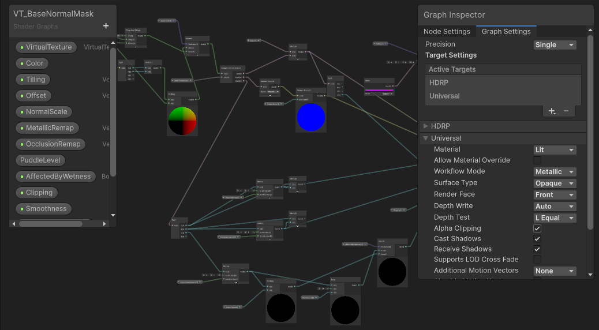
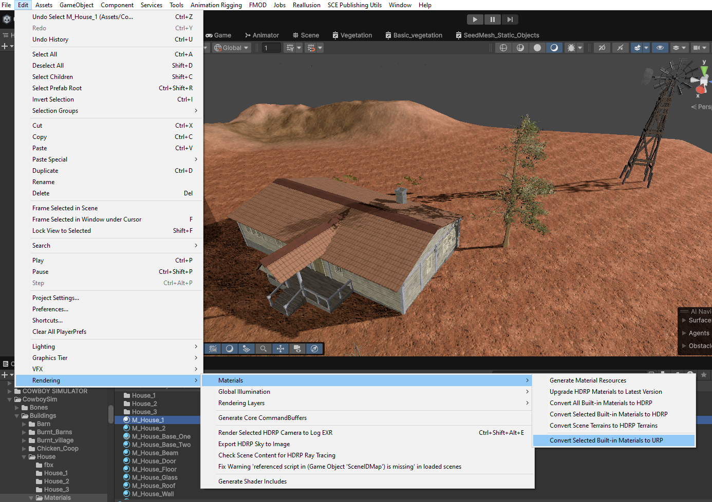
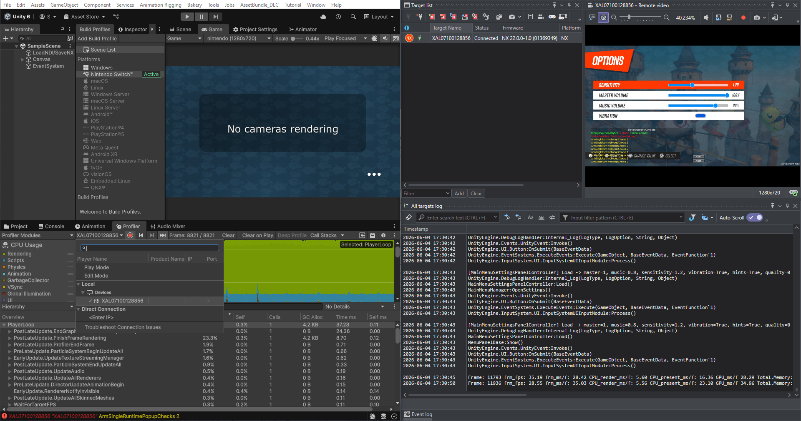
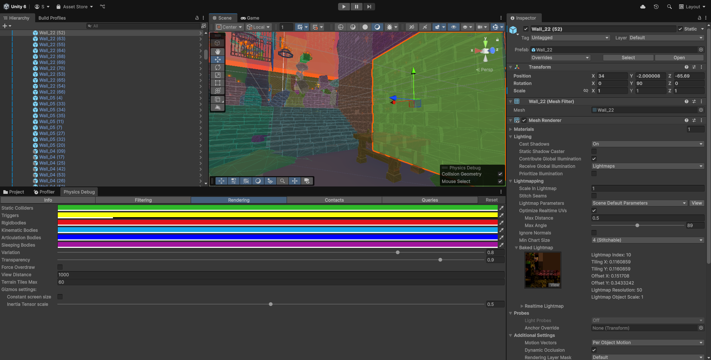
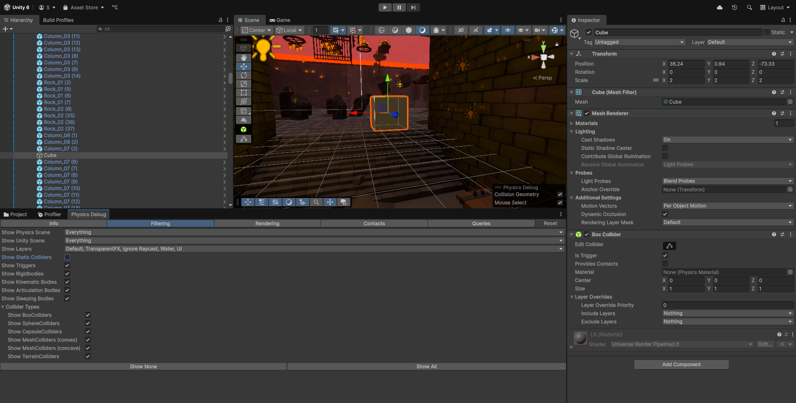
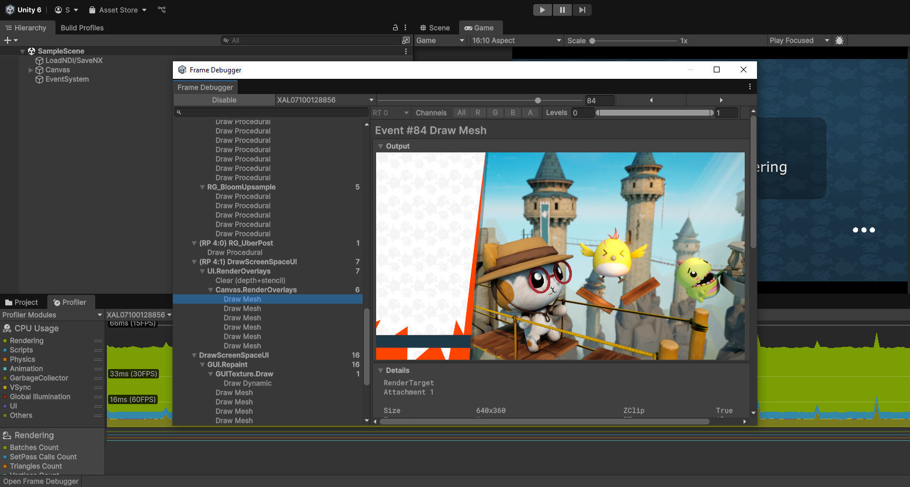

# Graphics/Optimization

## Смена HDRP на URP

Установка пакета **Universal Render Pipeline**:

- Установите **URP** в **Window** > **Package Management** > **Package Manager** > **Unity Registry** > **Universal Render Pipeline**
- Смените пресет по умолчанию на **URP** в окне **Edit** > **Project Settings** > **Graphics**
- Настройте уровни качества в **Edit** > **Project Settings** > [**Quality**]( https://docs.unity3d.com/Manual/class-QualitySettings.html)

Добавление **URP** в настройки шейдера:

- Зайдите на сцену
- Выберите **3-D модель** со сломанным материалом (розового цвета - #ff00ffff)
- В окне **Inspector** (++ctrl+3++) найдите используемый шейдер
- Если это кастомный шейдер в **Shader Graph** , нажмите **Edit Shader...**
- Добавьте **URP** с настройкой `Alpha Clipping` и Сохраните (++ctrl+s++)

???+ example "Пример настроек из Shader Graph"

    

Чтобы перевести материалы, **шейдеры которых не поддерживают URP**:

- В окне **Project** выберите все материалы, которые вы бы хотели поменять
- Смените шейдер на **Standard (SRP)**
- Используйте встроенный конвертер для апгрейда: **Edit** > **Rendering** > **Materials** > **Convert Selected Build-in Materials to URP**.

???+ example "Конвертация Built-in материалов в URP"

    

!!! note

    Также, вы можете попробовать применить ассет [HDRP to URP Downgrader v1.1](https://trello.com/c/uLKQaVWh/41-convertor-material-hdrp-to-urp).

## Мигание света на сцене

Если при перемещении по сцене некоторые источники света мигают - проверьте количество источников **Realtime** освещения в окне **Window** > **Rendering** > **Light Exploder**. 

Также, проверьте текущие лимиты в **Project Settings** > **Quality** > **Render Pipeline Asset** > `Inspector` > **Lighting** > **Per Object Limit**. В отличие от ПК, консоль поддерживает до **8** источников света на одну сетку (компонент `Mesh Renderer`).

Если проблема в лимите или количестве источников света - увеличьте лимит, замените часть источников на модели с эмиссивным материалом и/или запеките освещение на сцене.

## Оптимизация

Обеспечение стабильных **30+** кадров в секунду (FPS) требует **балансировки** нагрузки **между CPU и GPU**.

Выберите подходящий инструмент и проверьте как работает билд **на целевой платформе**. Исходя из полученных данных примените соответствующие [методы по оптимизации][Analysis]:

- **Снижение нагрузки на CPU**: настройка Матрицы физики ([Layer Collision Matrix][Layer-based collision]); удаление лишних компонентов `Rigidbody`; замена [коллайдеров][Physics Debug] на примитивы (`Sphere`, `Box`) и/или включение параметра `Convex`/`Delaunay`; смена покадровых проверок вроде `Update()` на `Events`; ограничение количества одновременно включённых AI Agents (`NavMesh`); замена `Instantiate()`/`Destroy()` на Object Pooling; оптимизация кода и UI (например, система вложенных `Canvas` для разделения фона и анимаций -> [prevent Canvas Rebuild][Frame Debugger])
- **Снижение нагрузки на GPU**: `Render scale` 0.8-0.9; уменьшение количества рисуемых объектов в одном кадре (Draw Calls): уменьшение [дальности прорисовки][Far clipping plane] (`Camera` > `Clipping Planes` > `Far`), настройка рендеринга (основная нагрузка - Тени, Bloom, SSAO); замена тяжёлых кастомных шейдеров на стандартные; меньше объектов с прозрачностью (Overdraw) -> например, убрать часть слоев у компонента `Terrain`
- **Перенос с GPU на RAM**: запечка [Occlusion culling][Occlusion culling]; запечка освещения ([Baked Light][Baked Light]); система [Level of Detail (LOD)][Level of Detail]; конвертация `Terrain` в 3-D модель ассетом [Terrain To Mesh][Terrain To Mesh]
- **Освобождение RAM**: [сжатие текстур][Compressor Texture]; стриминг аудио; удаление лишних уровней LOD (достаточно хорошо настроенных 2-3); использование AssetBundles или Addressables вместо прямой [загрузки ассетов][Runtime asset management]; кэширование данных; очистка памяти (например, в пустой сцене с загрузочным экраном) при помощи `Resources.UnloadUnusedAssets()`

!!! note

    На розничной версии первого поколения Nintendo Switch приложению доступно 3,2 ГБ памяти из 4 RAM, но с учетом ~ 0,6 ГБ расходов Unity, основной игре доступно около 2,6 ГБ.

!!! warning

    После глобального сжатия текстур, сбросьте `Override` размера для `Baked Lightmaps`, чтобы не было смещения теней! Проверить это можно в окне **Window** > **Rendering** > **Lighting** > **Baked Lightmaps**.

??? note "Пример запуска метода в `MonoBehaviour` по событию"

    ``` CSharp title="OnEventsExecute.cs"
    using System;
    using UnityEngine;
    using UnityEngine.Events;

    public sealed class OnEventsExecute : MonoBehaviour
    {
        [Flags]
        public enum GameEvent
        {
            None = 0,
            Awake = 1 << 0,
            Start = 1 << 1,
            OnEnable = 1 << 2,
            OnDisable = 1 << 3,
            OnApplicationFocus = 1 << 4,
            OnApplicationPause = 1 << 5,
            OnApplicationQuit = 1 << 6,
            OnDestroy = 1 << 7,
        }

        [SerializeField] private GameEvent triggerOn = GameEvent.Awake;
        [SerializeField] private UnityEvent action;

        /// <summary>
        /// Checks if <paramref name="e"/> is selected in <see cref="triggerOn"/>.
        /// If so, logs the event name to the Console and invokes <see cref="action"/>.
        /// </summary>
        private void Invoke(GameEvent e)
        {
            if ((triggerOn & e) == 0) return;
            Debug.LogError($"<color=teal>Executed {e}</color>");
            action.Invoke();
        }

        private void Awake() => Invoke(GameEvent.Awake);
        private void Start() => Invoke(GameEvent.Start);
        private void OnEnable() => Invoke(GameEvent.OnEnable);
        private void OnDisable() => Invoke(GameEvent.OnDisable);
        private void OnApplicationFocus(bool hasFocus) { if (hasFocus) Invoke(GameEvent.OnApplicationFocus); }
        private void OnApplicationPause(bool isPaused) { if (isPaused) Invoke(GameEvent.OnApplicationPause); }
        private void OnApplicationQuit() => Invoke(GameEvent.OnApplicationQuit);
        private void OnDestroy() => Invoke(GameEvent.OnDestroy);
    }
    ```

[Analysis]: https://docs.unity3d.com/Manual/analysis.html
[Layer-based collision]: https://docs.unity3d.com/Manual/LayerBasedCollision.html
[Physics Debug]: https://docs.unity3d.com/Manual/PhysicsDebugVisualization.html
[Frame Debugger]: https://docs.unity3d.com/Manual/FrameDebugger-debug.html
[Far clipping plane]: https://docs.unity3d.com/Manual/UnderstandingFrustum.html
[Occlusion culling]: https://docs.unity3d.com/Manual/OcclusionCulling.html
[Baked Light]: https://docs.unity3d.com/Manual/LightModes-introduction.html
[Level of Detail]: https://docs.unity3d.com/Manual/LevelOfDetail.html
[Terrain To Mesh]: https://trello.com/c/I964mG8n/37-terrain-optimization
[Compressor Texture]: https://trello.com/c/6PvnJtNf/27-new-test-tools-convertor-material-compressor-texture-srp-urp-hdrp
[Runtime asset management]: https://docs.unity3d.com/Manual/assets-managing-introduction.html

Сделайте билд с галочкой `Development` и [подключите консоль к ПК][Target Manager]. Установите и запустите приложение, далее выберите цель в окне **Profiler** (++ctrl+7++):

[Target Manager]: ../nintendo/switch-target-manager.md

???+ example "Профилирование на подключенной консоли"

    

Для проверки физики на сцене откройте **Window** > **Analysis** > **Physics Debugger**:

???+ example "Включите `Gizmos` и `Mouse Select` в окне `Scene` для удобного выделения"

    

???+ example "Отключите `Show Static Colliders` чтобы найти триггер-зоны"

    

Пошаговый анализ отрисовки кадра доступен в **Window** > **Analysis** > **Frame Debugger**:

???+ example "Проверка покадровой отрисовки для оптимизации UI"

    

!!! note

    Убедитесь что на сцене только одна активная камера, так как их избыток увеличивает нагрузку на GPU. Для этого, выполните поиск по компоненту `t: Camera` в окне иерархии.

    Если вторая камера все же необходима (например, для мини-карты) - настройте её отдельно. Примените фильтр слоёв, уберите тени, `Global Volume` и другие "тяжёлые" функции рендеринга.


## Анализ проекта

Основными инструментами для анализа проекта являются:

- [Project Auditor](https://docs.unity3d.com/Manual/project-auditor/project-auditor-introduction.html)
- [Profiler ](https://docs.unity3d.com/Manual/profiler-introduction.html)
- [Memory Profiler](https://docs.unity3d.com/Packages/com.unity.memoryprofiler@1.1/manual/memory-on-device.html)
- [Visual Studio debugger](https://learn.microsoft.com/ru-ru/visualstudio/debugger/debugger-feature-tour?view=visualstudio)
- [Debug.LogError](https://docs.unity3d.com/ScriptReference/Debug.LogError.html)

!!! tip "Unity Debug Styling"

    Unity класс `Debug` поддерживает [Rich-Text форматирование](https://docs.unity3d.com/Packages/com.unity.ugui@2.0/manual/StyledText.html).