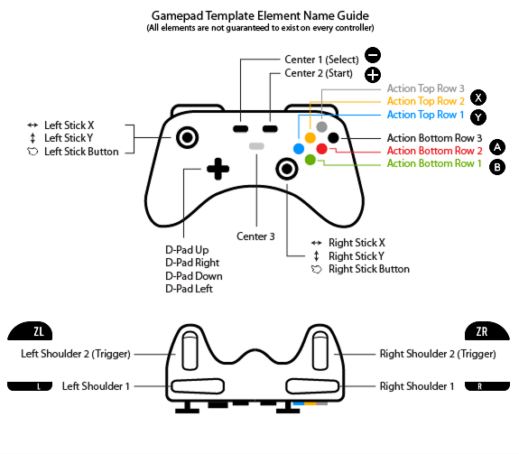
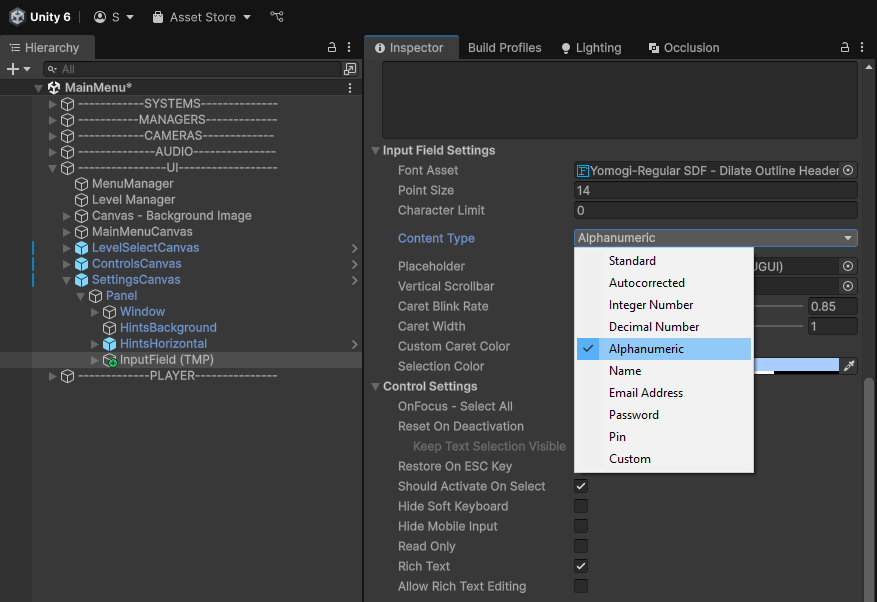

# Managing Inputs

## Настройка Input System

Если в проекте используется **Unity Input System** - добавьте **соответствующий платформе** и **версии Unity проекта** пакет в папку `..\Packages` из папки с установленным SDK:

- Например, откройте `C:\Nintendo\Unity6000.1.15_NXAddon20.5.6-Unity6.1\UnityForNintendoSwitch\Packages`
- Скопируйте папку `com.unity.inputsystem.switch@0.1.7-pre`
- Откройте `C:\Work\Project_Name\Packages`
- Вставьте папку и дождитесь рекомпилляции проекта
- Проверьте чтобы в **Project Settings** > **Player** > **Other Settings** > **Controls** > **Supported Npad Styles** > были настройки **Full Key, Handheld, Joy Dual**

!!! note
    Если в проекте созданы глобальные настройки ввода в **Project Settings** > **Input System Package** > **Settings** > Добавьте в **Supported Devices** строки **Switch Controller (on Switch)** и **Switch Pro Controller**. Они будут отображаться в списке как **NPad** и **SwitchProControllerHID**.

    **Опционально**: добавьте по-необходимости **Gamepad**, **Keyboard**, **Mouse** и **Virtual Mouse**.

??? note "Пример вызова метода по нажатию на кнопку (связь с действием из Input Action)"

    ``` CSharp title="InputActionSample.cs" linenums="1"
    using UnityEngine;
    using UnityEngine.InputSystem;

    public sealed class InputActionSample : MonoBehaviour
    {
        [SerializeField] private InputActionReference _inputAction;
        
        private void OnEnable()
        {
            if (_inputAction == null) return;
            _inputAction.action.performed += SomeMethod;
            _inputAction.action.Enable();
        }
        
        private void OnDisable()
        {
            if (_inputAction == null) return;
            _inputAction.action.performed -= SomeMethod;
            _inputAction.action.Disable();
        }

        /// <summary>
        /// Receives the <see cref="InputAction.CallbackContext"/> from the bound action.
        /// Replace this body with your own logic.
        /// </summary>
        private void SomeMethod(InputAction.CallbackContext context)
        {
            Debug.LogError("<color=cyan>SomeMethod triggered</color>");
        }
    }
    ```

Если вы не работали с этим пакетом или не знакомы с основами кросс-платформенного ввода рекоммендую посмотреть официальный туториал от Unity: :fontawesome-brands-youtube:{ .youtube } [YouTube](https://youtu.be/5tOOstXaIKE?si=GkKBFIcOye7RFGBV).

> Подробнее о Input System в [документации Unity](https://docs.unity3d.com/Packages/com.unity.inputsystem@1.19/manual/ActionsEditor.html).

## Rewired Input System

Если в вашем проекте уже установлен ассет **Rewired** - добавьте **соответствующий платформе** и **версии Unity проекта** пакет (папку _Plugins_) в `..\Assets\Rewired`.

Далее, следуйте шагам, указанным в  [документации][Rewired Input]:

- Создайте сцену с названием `SplashScene`
- Добавьте пустой объект `LoadNDI` с `LoadNDI.cs`
- Добавьте `RewiredEventSystem.prefab` с `DontDestroyOnLoad.cs`
- Создайте `NintendoSwitchInputManager` нажатием на кнопку
- Измените **Supported Npad Styles** на **Nothing** в настройках **Player**
- Настройте в Rewired `Input Manager`, `Player`, `Actions` и `Maps`
- Присвойте **Rewired Player** соответствующие `Maps`
- Замените `Input.GetMouseButtonDown(0)` > `_player.GetButtonDown("Submit")`

[Rewired Input]: https://trello.com/c/KgRB46zb/42-rewired

???+ example "Пример расположения кнопок для Nintendo Switch"

    

> Подробнее о настройке Rewired в [документации Rewired](https://guavaman.com/projects/rewired/docs/QuickStart.html).

### Интеграция Rewired в RCC

Если проект использует старые версии ассета [Realistic Car Controller] с **Rewired Input** - добавьте поддержку платформы **Nintendo Switch** по примеру из [документации](https://trello.com/c/40nJGa59/8-integration-rewired-to-rcc).

[Realistic Car Controller]: https://www.bonecrackergames.com/realistic-car-controller/

## Вибрация для контроллера

Вибрацию в играх с поддержкой **Unity Input System** как правило добавляют так:

``` CSharp
Gamepad.current.SetMotorSpeeds(0.25f, 0.75f);
```

> Подробнее в [документации Unity](https://docs.unity3d.com/Packages/com.unity.inputsystem@1.19/manual/Gamepad.html#rumble).

Самые частые проблемы:

- **Бесконечная вибрация** при включении Паузы, когда `Time.timeScale = 0` (не срабатывает остановка вибрации через `Invoke`)
- Завершение вибрации не срабатывает в `Coroutine`, если для отсчета интервалов используются `WaitForSeconds` или `Time.deltaTime`
- `NullReferenceException` в **Unity Editor** при отсутствии подключенного контроллера

Решением является замена `Time.deltaTime` на `Time.unscaledDeltaTime`, `WaitForSeconds` на  `WaitForSecondsRealtime` или `Invoke` на `Coroutine`, с учетом сказанного ранее.

В некоторых случаях, когда зависимость от игрового времени не обязательна - можно сделать метод остановки вибрации асинхронным:

``` CSharp
private async void ResetHaptics()
{
    await Task.Delay(500);

    if (Gamepad.current == null) return;

    Gamepad.current.ResetHaptics();
}
```

## Попап Joy-Con Grip

Для отображения попапа с текстом `The Joy-Con Grip Accessory is Recommended when Playing` **при смене режима игры** (например, с `Handheld` на `Tabletop`) - добавьте пакет [`CheckNintendoInputSingle.unitypackage`][Input Nintendo Check] в папку `..\Assets\_Nintendo`.

По-необходимости, дизайн `Warning_JOY-CON.prefab` можно поменять в соответствии с Figma. Найти его можно в папке проекта и далее `..\Assets\Resources`.

[Input Nintendo Check]: https://trello.com/c/AGXNzLx1/13-input-nintendo-check

### Частые проблемы

Если после установки пакета попап **не появляется**:

- Выставьте `Sort Order` для компонента `Canvas` на **32767** (в `Warning_JOY-CON.prefab`)
- Проверьте чтобы ничего не разрушало его в рантайме (`Resources.UnloadUnusedAssets()`)

## Фильтр матов в Input Field

Если в проекте есть возможность вписывать текст в `Input Field` - необходимо изменить его `ContentType` на `Alphanumeric` и реализовать фильтр для нецензурных слов.

Пример валидации ввода:

- Добавьте в проект [`NintendoCheckProfanity.cs`][Check Profanity]
- Вызовите метод `HasProfanity()` после подтверждения ввода
- Если метод возвращает `true`, очистите поле и покажите попап с ошибкой (например, `"Please avoid offensive words"`)

[Check Profanity]: https://trello.com/c/mCRuUhHb/4-online-multiplayer-network-check-check-profanity-loadndi-ndiloadmenu

??? note "Пример валидации текста"

    ``` CSharp
    public void OnSubmitInput(string text)
    {
        if (HasProfanity(text))
        {
            StartCoroutine(HandleProfanityDetected());
            return;
        }

        // Input OK, continue...
    }

    private bool HasProfanity(string input)
    {
        if (string.IsNullOrWhiteSpace(input)) return false;

    #if UNITY_SWITCH
        return !NintendoCheckProfanity.CheckProfanityWordsSample(input);
    #else
        string[] bannedWords = { "badword1", "badword2", "badword3" };
        string lowerInput = input.ToLower();

        foreach (string word in bannedWords)
        {
            if (lowerInput.Contains(word))
            {
                return true; // Profanity detected
            }
        }
        return false; // Clean text
    #endif
    }

    private IEnumerator HandleProfanityDetected()
    {
        roomNameInputField.text = string.Empty;
        invalidSessionPopUp.SetActive(true);

        yield return new WaitForSecondsRealtime(1.5f);

        invalidSessionPopUp.SetActive(false);
    }
    ```

??? example "Пример настройки Input Field (TMP)"

    

## Отключение Touch Screen

Чтобы отключить сенсорный экран:

- Перейдите в **Edit** > **Project Settings** > **Player**
- Откройте раздел **Other Settings** на нужной платформе
- Пролистайте вниз до **Controls** и отключите чекбокс `Enable Touch Screen`
- Закройте редактор **Unity** и сделайте коммит (_ProjectSettings.asset_)