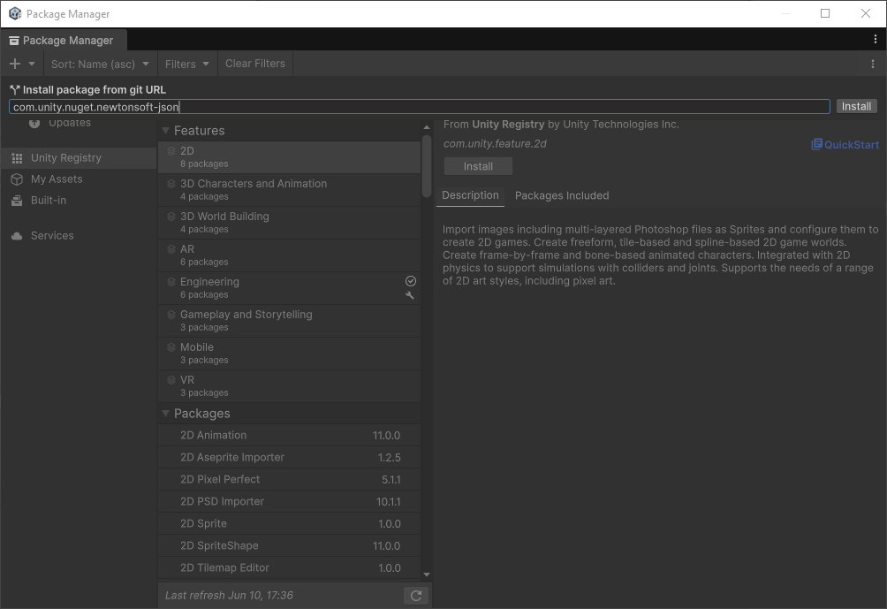
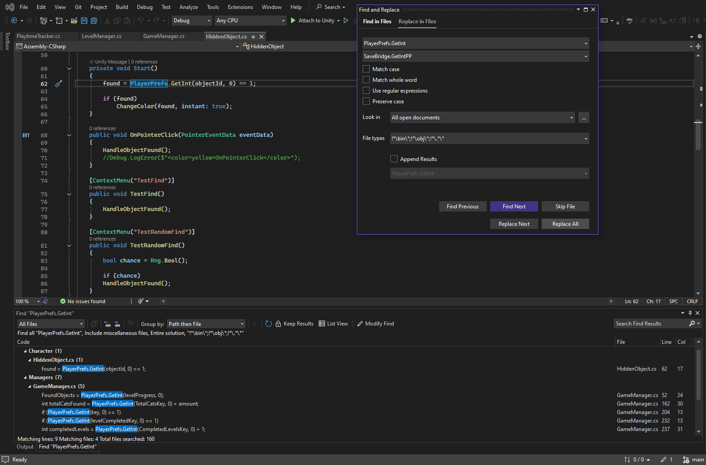

# Refactoring Save/Load

## Save/Load System

На платформах **Standalone (ПК)** и **PlayStation** сохранение и загрузка прогресса выполняются через `PlayerPrefs` или ассет Easy Save (ES3). Для **Nintendo Switch** все вызовы `PlayerPrefs` должны быть заменены на `SaveBridge` или `SwitchPrefs`.

!!! note

    Иногда ассеты загружаются на фоне при помощи [атрибута][Attribute] `[RuntimeInitializeOnLoadMethod]`.

    > Подробнее о порядке вызова [системных методов Unity](https://docs.unity3d.com/Manual/execution-order.html).

[Attribute]: https://docs.unity3d.com/6000.4/Documentation/ScriptReference/RuntimeInitializeOnLoadMethodAttribute.html

## Проекты на Unity 202X

Для апгрейда c версий Unity 5 до Unity 6 проектов с уже интегрированным пакетом `PlayerPrefs_Switch` рекоммендуется использовать пакет `SwitchPrefs`.

> Подробнее в [документации][SwitchPrefs].

[SwitchPrefs]: https://trello.com/c/ElZ4C5dq/65-switch-player-prefsunity-6-to-switchprefs

### Частые проблемы

Если после установки пакета в редакторе Unity появилась ошибка: `The type or namespace name "Newtonsoft" could not be found`:

- Откройте окно **Window** > **Package Management** > **Package Manager**
- Переключитесь на вкладку **Unity Registry**
- Нажмите на **(+)** в левом верхнем углу и выберите `Install package from git URL...`
- Введите в поле `com.unity.nuget.newtonsoft-json` и нажмите `Install`

??? example "Пример установки пакета Newtonsoft"

    

## Проекты на Unity 6

Для рефактора новых проектов можно использовать `SwitchPrefs` или `SaveBridge`.

Обратите внимание, что в случае с `SaveBridge` названия методов немного изменятся. Так, `PlayerPrefs.GetInt` станет `SaveBridge.GetIntPP`, `PlayerPrefs.SetInt` > `SaveBridge.SetIntPP` и, по-аналогии, то же самое с `Int/Float/String/Key`.

Пример можно найти в файле `SaveBridge.cs`, в регионе PlayerPrefs Helper.

!!! warning

    Важно знать, что метод `PlayerPrefs.DeleteAll()` не работает на Nintendo Switch. Для удаления сохранений вам придется удалять ранее созданные ключи, либо сбрасывать их значения на `default`.

??? note "Пример метода SaveBridge.DeleteAllPP"

    ``` CSharp title="Добавьте в SaveBridge.cs"
        // SaveBridge.DeleteAllPP
        public static void DeleteAllPP()
        {
    #if UNITY_SWITCH && !UNITY_EDITOR
            cache.Clear();
            ES3.DeleteFile();
    #else
            PlayerPrefs.DeleteAll();
    #endif
            SaveAllData();
        }
    ```

> Подробнее в [документации][SaveBridge].

[SaveBridge]: https://trello.com/c/tJRPsbDi/48-savebridge-unity-6

### Работа в Visual Studio

Удобным методом замены является:

- Открыть любой файл _Assembly_ (например, из редактора Unity)
- Cделать глобальный поиск (++ctrl+shift+f++) по запросу `PlayerPrefs.GetInt`
- Открыть все, кроме скриптов Easy Save (ES3), SaveBridge, Rewired и других библиотек
- Заменить эту строку на новую, поменяв настройку поиска на `All open documents`
- Повторить `поиск` > `замену` с другими методами `PlayerPrefs` (`Float/String/Key`)

??? example "Find and Replace > Replace in Files > All open documents > Replace All"

    

!!! tip

    После завершения проверьте возможные ошибки компиляции нажав ++ctrl+shift+b++.

### Открытие Паузы при нажатии на HOME

В некоторых проектах, где прогресс игрока может быть нарушен при сворачивании игры нажатием на кнопку **HOME** (домик), необходимо добавить открытие меню **Pause** в момент перехода приложения в _фоновой режим_.

Для этого, подпишитесь на `OnBackground` в классе, что отвечает за включение меню Паузы. Сам `event` находится в `SwitchExitHandling.cs` или `SwitchHandlerMessage.cs`:

``` CSharp
public class PauseManager : MonoBehaviour
{
    private void OnEnable()
    {
        SwitchExitHandling.OnBackground += PauseGame;
    }

    private void OnDisable()
    {
        SwitchExitHandling.OnBackground -= PauseGame;
    }

    public void PauseGame()
    {
        // Pause logic
    }
}
```

??? note "Пример подписки на OnBackground"

    ``` CSharp title="PauseManager.cs" linenums="1"
        using UnityEngine;
        using System.Collections;

        public class PauseManager : MonoBehaviour
        {
            public static PauseManager Instance;

            public bool IsPaused { get; private set; }

            private void Awake()
            {
                if (Instance == null)
                {
                    Instance = this;
                }
            }

            private void OnEnable()
            {
                SwitchExitHandling.OnBackground += PauseGame;
            }
            private void OnDisable()
            {
                SwitchExitHandling.OnBackground -= PauseGame;
            }

            public void PauseGame()
            {
                if (IsPaused) return;

                IsPaused = true;
                Time.timeScale = 0f;

                if (InputManager.PlayerInput != null)
                {
                    InputManager.PlayerInput.SwitchCurrentActionMap("UI");
                }
            }

            public void UnpauseGame()
            {
                if (!IsPaused) return;

                IsPaused = false;
                Time.timeScale = 1f;

                StartCoroutine(ResumeInputSafely());
            }

            private IEnumerator ResumeInputSafely()
            {
                yield return null;

                if (InputManager.PlayerInput != null)
                {
                    try
                    {
                        InputManager.PlayerInput.SwitchCurrentActionMap("Player");
                        Debug.Log("Game resumed successfully");
                    }
                    catch (System.Exception ex)
                    {
                        Debug.LogError($"Error resuming input: {ex.Message}");
                    }
                }
                else
                {
                    Debug.LogError("InputManager.PlayerInput is NULL when trying to resume!");
                }
            }
        }
    ```

## Тесты методов в Unity Editor

Чтобы проверить функционал в редакторе Unity, добавьте над методом атрибут [ContextMenu] (например, `[ContextMenu("SomeMethod")]`). Найдите объект с этим скриптом в окне **Inspector** на сцене, нажмите на три точки у компонента `(Script)` и выберите свое контекстное меню. Оно запустит ваш тестовый метод. Работает вне зависимости от **Play Mode**.

[ContextMenu]: https://docs.unity3d.com/ScriptReference/ContextMenu.html